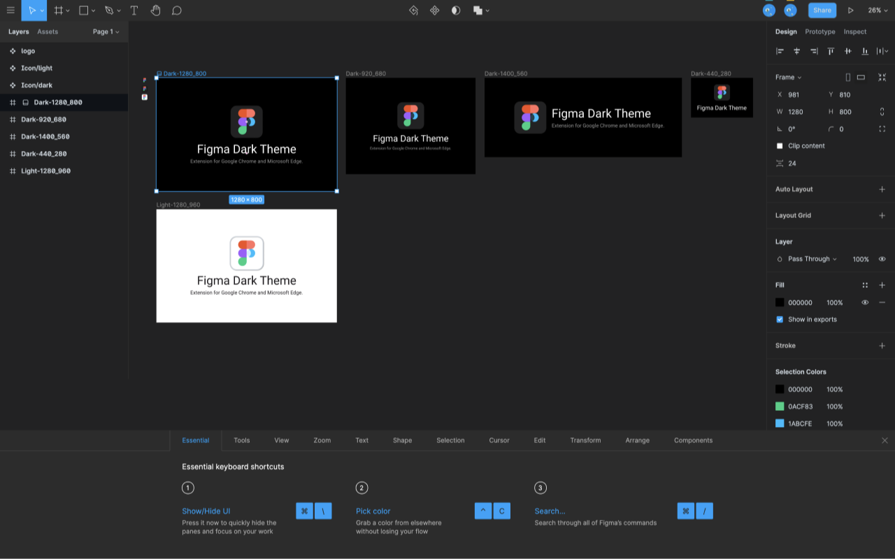
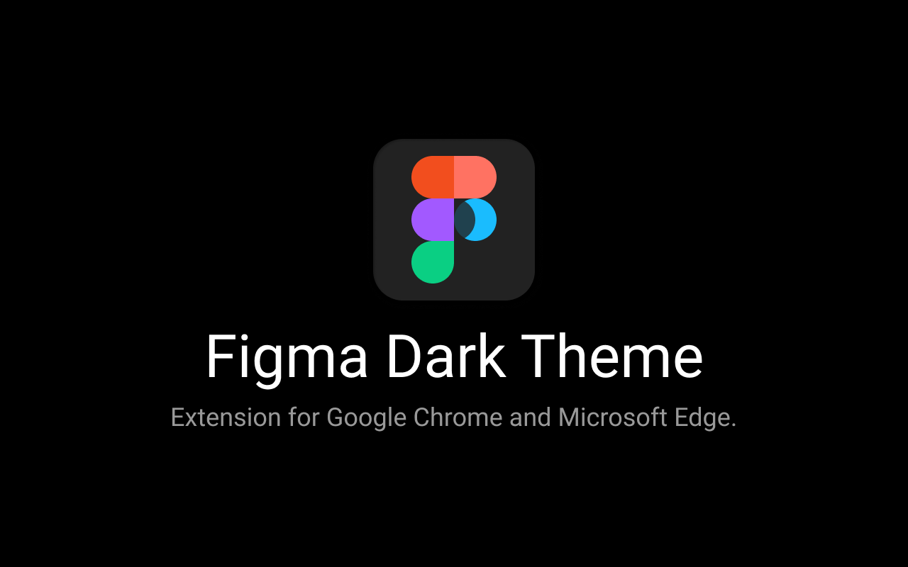
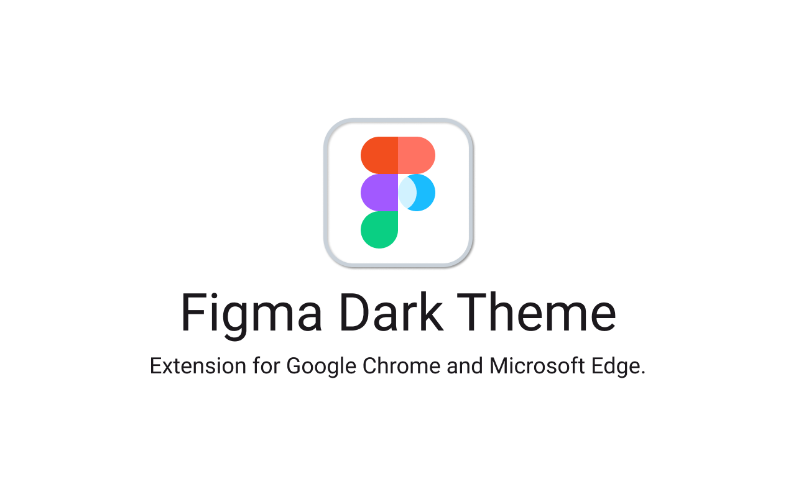

# Figma Dark Theme

[English](./README.md) | [中文简体](./README.zh.md)

Figma Dark Theme - Extension for Google Chrome and Microsoft Edge.

This extension will change appearance of all Figma pages and editor to a dark theme.



## Install

**[Chrome Extension]()**

**[Edge Extension](https://microsoftedge.microsoft.com/addons/detail/figma-dark-theme/pniljokeankpoomopaaekblacciihnpp)**

## Resource

**[Figma Draft](https://www.figma.com/community/file/921577254332071556/Figma-Dark-Theme)**

### Logo


### Preview





## Build && Contribute

You shold install the `zip` package on your marchine firstly.

```bash
# Add executable permission
chmod +x build.sh

# Build
bash build.sh
```

Then you can find files in `dist` directory.
