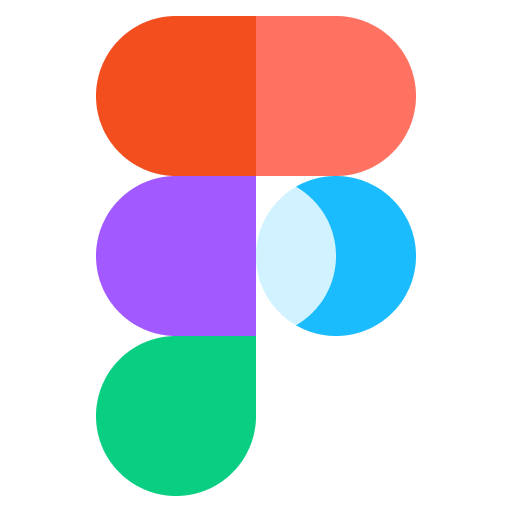
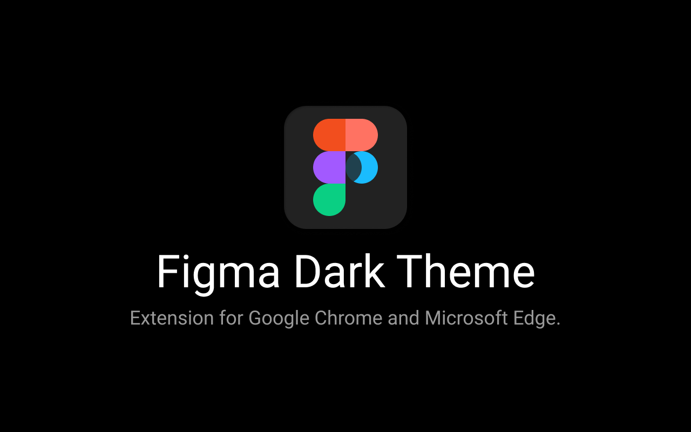
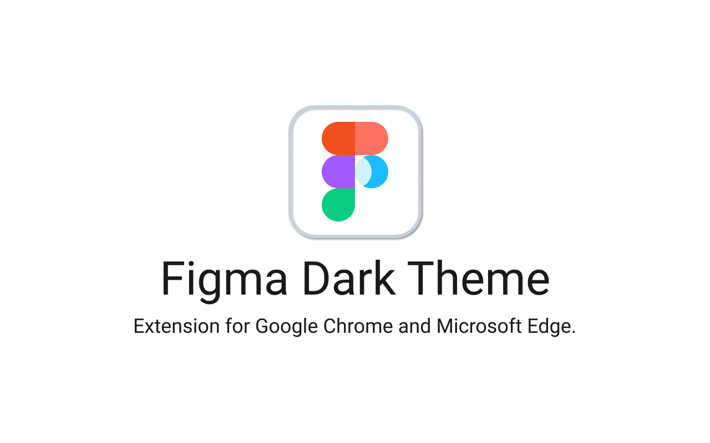

# Figma 深色主题

[English](./README.md) | [中文简体](./README.zh.md)

用于 Google Chrome 和 Microsoft Edge 浏览器的 Figma 网页版暗黑模式。

拓展程序会将所有 Figma.com 网站及编辑器的页面的更改为深色主题。

## 安装

**[Chrome 扩展程序]()**

**[Edge 扩展程序](https://microsoftedge.microsoft.com/addons/detail/figma-dark-theme/pniljokeankpoomopaaekblacciihnpp)**

## 资源

**[Figma Draft](https://www.figma.com/community/file/921577254332071556/Figma-Dark-Theme)**

### Logo

### 预览

